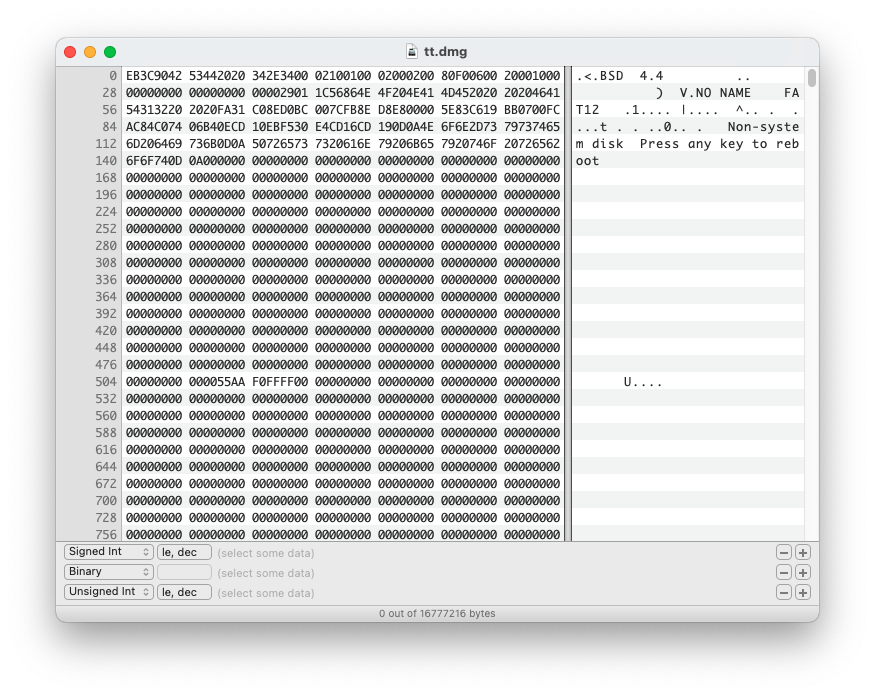

# 汇编课设报告

# 项目概述

本次课设的任务是参考课本七八章的知识，实现一个加载器。我学习了书上的内容和前人一些优秀的项目实现了自己的加载器，并编写了一个简单的 kernel ，实现了简单的图形界面和工作程序加载。

# 开发环境

IDE：vscode

编译器：nasm

虚拟机：qemu

构建工具：make

项目管理：git

辅助工具：dd, hexf, gdb

本项目在 macOS 下开发，采用 unix 工具链，通过 vscode 编辑好代码后使用 makefile 中的指令进行编译运行，构建镜像文件，最后通过 qemu 启动

# 实验介绍

## 磁盘准备

项目主要有 bootloader（mbr扇区），kernel 和工作程序组成，整体工作流程是：上电完成 BIOS 加载，系统自检后由 BIOS 从启动硬盘首扇区（mbr）加载 bootloader 并跳转执行，由 bootloader 进行自身腾挪，加载 kernel 后跳转进入 kernel ，最后在 kernel 中进行其它操作，包括简易图形界面实现和工作程序加载。上述文件都需要从硬盘加载到内存中才可以执行，书上是将文件直接放在某一个扇区中，但这种方式很不灵活，需要直接将二进制文件写入虚拟磁盘，可能造成文件冲突、损坏。解决这个问题最简单的方法就是采用文件系统，因此我实现了一个简单的 `Fat12` 文件系统。首先生成磁盘镜像

```bash
hdiutil create -fs "MS-DOS FAT12" -size 16m -layout None $(DISK)
```

这样就创建了一个 16m 的，格式为 `Fat12` 的磁盘镜像，查看其二进制



可见其0扇区已经有一定的数据，通过 `file` 命令可以看到

```
tt.dmg: DOS/MBR boot sector, code offset 0x3c+2, OEM-ID "BSD  4.4", sectors/cluster 16, root entries 512, sectors 32768 (volumes <=32 MB), sectors/FAT 6, sectors/track 32, heads 16, serial number 0x86561c01, unlabeled, FAT (12 bit), followed by FAT
```

前面的数据是磁盘的属性，因此在编写自己的 bootloader 时也要保留这些信息（虽然没有也可以启动，但有当然更好）。参考 mbr 引导记录的结构和相关教程，我编写了自己的头部数据

```wasm
bits 16

jmp StartOfEverything
nop

OEMLabel db "Creedowl"
BytesPerSector dw 512
SectorsPerCluster	db 16
ReservedForBoot dw 1
NumberOfFats db 2
RootDirEntries dw 512 ; 512 * 32 = 32扇区
LogicalSectors dw 32768
MediumByte db 0F0h
SectorsPerFat dw 6
SectorsPerTrack dw 32
Sides 	dw 16
HiddenSectors dd 0
LargeSectors dd 0
DriveNo 	dw 0
Signature db 41
VolumeID dd 0066ccffh
VolumeLabel db "Creedowl   "
FileSystem db "FAT12   "
```

首先头 3 bit 要求是跳转指令，可以跳转到第一条指令，接下来就是 62 byte 的属性信息，根据上面的 file 信息进行填写，接下来就可以开始编写 bootloader 真正的代码了

## bootloader

### 自身腾挪

BIOS 会将 bootloader 加载到 `0x7C00` 处，需要正确设置段寄存器才能保证代码和数据段正常工作，这里也困扰了我一段时间，因为定义的数据始终不正确，最后发现是数据段错了，需要将数据段（cs）设置成 `0x7C0` 才能正常工作。

接着是实现自身腾挪，我将 bootloade 的代码移动到 `0060H:0000H` 并跳转执行，相关的代码书上很详细了，注意转移时要正确设置段寄存器（虽然不进行腾挪也没问题，我最后没有用到这部分内存）

```wasm
mov ax, 0060H
mov es, ax
xor di, di ; 0060H:0000H
xor si, si
cld
mov cx, 100H ; 512 byte
rep movsw
push es ; 返回段值入栈
push Start ; 返回偏移入栈
retf ; 段间返回到 es:Start
```

### Fat12

上面说了我采用了 Fat12 格式的文件系统，所以读取文件时需要进行一点解析工作，这里先介绍一下 Fat12 的结构。首先是一个扇区（512 bit）的 mbr 引导记录；接着是两个完全相同的 fat 表，fat1 和 fat2 ，其中储存着 fat12 的簇信息（下文介绍），表的大小为 6 扇区，共 12 个扇区；再往后是根目录区，保存着 fat12 的根目录信息，每一个目录项的大小为 32 byte ，有 512 个目录，共占 32 个扇区；最后剩下的空间为数据区，每块区域由 16 个扇区组成。注意以上数据和镜像文件的大小也有关系，所以头部数据还是很重要的

实现完整的文件系统操作有些太复杂了，也偏离了本次实验的方向，因此我只实现了根目录下文件的读取。整个读取流程为：遍历根目录查找 kernel 文件（每个目录项的头 11 byte 是文件名信息，包括 8 byte 文件名和 3 byte 拓展名），找到后其偏移量 26 byte 处的 2 byte是文件的首簇号。簇号类似链表的指针，用于表示一个数据块的下一块位置，其关联信息保存在前面的 fat 表中，每一个簇号由 3 byte 组成。因此得到首簇号后就可以从磁盘文件对应的偏移中加载数据到内存，再到 fat 表中查找下一簇号，判断结束读取还是读取下一块数据

所以按照上述流程编写代码即可，我采用了磁盘拓展读的方式进行读取数据，不用去计算复杂的 chs ，只需要定义好 DAP 结构

```wasm
DAP:
  db 10H ; DAP大小
  db 0 ; 保留
  dw 0 ; 扇区数
  dw 0 ; 缓冲区偏移
  dw 0 ; 缓冲区段值
  dd 0 ; LBA低4字节
  dd 0 ; LBA高4字节
```

读取数据的过程中也需要一些计算，包括目录区偏移，数据区偏移，以及最复杂的簇号计算，部分代码如下

```wasm
; 计算当前簇在fat表中的位置, 每3个byte对应两个簇, cluster * 3 / 2 == 在fat表中的位置
  mov ax, [Cluster]  
  xor dx, dx
  mov bx, 3
  mul bx
  mov bx, 2
  div bx ; dx = cluster mod 2, 用于判断当前簇是奇数位还是偶数位
  mov si, Buffer
  add si, ax
  mov ax, [si]
  test dx, dx
  jz .Even

.Odd:
  ; 奇数位时要抛弃前4bit
  shr ax, 4
  jmp .NextCluster

.Even:
  ; 偶数位时取低12bit
  and ax, 0FFFH
```

这里我将 kernel 的数据加载到 `1000H:0000H` 处

mbr 工作效果如图


最后只需要跳转到 kernel 的地址，就可以摆脱首扇区 512 byte 的空间限制，进入内核了

```wasm
jmp 1000H:0000H
```

# kernel

## 系统调用

进入 kernel 后，就可以自由地使用空间了，我实现了一个简易的图形界面和工作程序加载。重新设置好段寄存器，就可以正式开始了。首先我模拟操作系统的系统调用，实现了一个简易的系统调用表，将 kernel 中的一些程序作为系统调用，供工作程序使用

```wasm
; 模拟系统调用
OS:
  jmp OS_Main ; 0000H
  jmp OS_Reboot ; 0003H
  jmp OS_PrintString ; 0006H
  jmp OS_MoveCursor ; 0009H
  jmp OS_Cls ; 000CH
  jmp OS_GetCursorPos ; 000FH
  jmp OS_SetBackground ; 0012H
  jmp OS_PrintStringWithColor ; 0015H
  jmp OS_HideCursor ; 0018H
  jmp OS_ShowCursor ; 001BH
  jmp OS_GetFilelist ; 001EH
  jmp OS_DrawBox ; 0021H
  jmp OS_DrawFileList ; 0024H
  jmp OS_ShowDateTime ; 0027H
  jmp OS_PutChar ; 002AH
  jmp OS_GetKey ; 002DH
  jmp OS_ReadFile ; 0030H
  jmp OS_ShowRegister ; 0033H
  jmp OS_Wait ; 0036H

  db 255 dup(0) ; 保证上述jmp指令的宽度都是3byte
```

这也是 kernel 的入口处，便于调用。在实际使用过程中，我踩了一个坑，jmp 指令会根据地址差选择不同的格式，指令长度有 2 byte ，3 byte 和 5 byte ，一开始我跳转地址和系统调用表较近，导致指令的长度不一致，一直跳转失败，最后在其中添加了 255 byte 的间隔空间，以保证指令长度一致

## 简易图形界面

### 加载目录信息

接着我实现了一个简易的图形界面，可以显示根目录中的文件，通过方向键进行选择，再通过回车进行加载执行，所以首先要获取文件列表，将 bootloader 里面的相关代码进行一些修改即可。思路是遍历整个根目录，将正确的文件目录项保存。一些需要排除的文件包括目录项首字节为 `0xE5`

 （已删除的文件），以及目录项偏移量为 11 处 1 byte 值不为 `0x20` （普通文件）。我将目录表（共 512*32 = 0x4000 byte）加载到 `1000H:3000H` 处，fat 表（共 512*6 = 0xC00 byte）加载到 `1000H:7000H` 处

### 绘制图形界面

绘制图形界面其实不复杂，主要通过 BIOS 提供的 `10H` 中断实现，BIOS 创建了一个中断处理程序提供了实模式下的视频服务。此类服务包括设置显示模式，字符和字符串输出，和基本图形（在图形模式下的读取和写入像素）功能，因此可以不用自己去操作显存

[INT 10H](https://zh.wikipedia.org/wiki/INT_10H)

核心流程是不断地移动光标，绘制矩形，设置颜色，输出文字和属性，具体内容在代码中都有较详细的注释了，运行效果如下


这里同时实现了 CMOS 中时间信息的读取和显示

```wasm
; 在top bar上显示时间日期, 来自CMOS
OS_ShowDateTime:
  pusha
  mov cx, 6 ; 年 月 日 时 分 秒
  mov si, .DTOffset ; CMOS中时间信息的布局
  mov di, .DateTime ; 输出格式
.NextTime:
  lodsb ; 加载时间信息偏移
  out 70H, al
  in al, 71H ; 读取一个时间信息
  mov ah, al ; 采用BCD码, 4bit表示一位十进制数, 转换成字符时需要分成两个byte
  shr al, 4 ; 高4位表示低位
  and ax, 0F0FH ; 各取4位
  add ax, 3030H ; 等于两个字符都加上'0'
  mov [di], ax ; 保存字符结果
  add di, 3
  loop .NextTime

  mov dh, 0
  mov dl, 62
  call OS_MoveCursor
  mov si, .DateTime
  call OS_PrintString

  popa
  ret

  .DateTime db "00/00/00 00:00:00", 0
  .DTOffset db 9, 8, 7, 4, 2, 0
```

此外还有键盘事件的响应，可以通过方向键选择用户程序


通过回车键运行


# 工作程序

工作程序我就简单地编写了三个，分别是 `helloworld` ，`logo` 和 `time` ，通过上面模拟的系统调用实现

`helloworld`


`logo`


`time`


不过在加载工作程序的时候我也遇到了一些问题，一开始是将工作程序加载到一个新的段中并跳转执行，通过段间调用来使用系统调用，实际过程中也可以调用，但无法返回到正确的段中，最后只好将工作程序和 kernel 放在同一个段中。此外在调用时因为对 `call` 指令不熟，采用立即数寻址无法跳转到正确的位置，最后查阅手册发现立即数是相对偏移，改成寄存器寻址解决问题

# 总结

本次实验我花费了不少时间和精力，查阅相关教程，文档，学习了一些开源项目，收获了很多，也基本实现了我的想法。但由于时间太过紧张，还有很多的内容来不及探索，包括自定义中断、加载 c 程序、更炫酷的工作程序、加载真正的操作系统等，项目中也存在一点奇怪的小 bug 还未修复，以及 makefile 的编写，目前只是能用，其中的规则还是很混乱。这些都是我原先想要做的内容，，如果老师能多给一两周的时间我或许能实现一个更加完善的项目。可惜来不及了，这个月大大小小各种考试实验作业挤得满满当当，只能留到后面学习操作系统时继续探索了，也是不小的遗憾。汇编课程到此也就全部结束了，感谢老师的教导。

# 参考资料

[INT 10H](https://zh.wikipedia.org/wiki/INT_10H)

[BIOS color attributes](https://en.wikipedia.org/wiki/BIOS_color_attributes)

[ASCII](https://zh.wikipedia.org/zh-hans/ASCII)

[80386 Programmer's Reference Manual -- Table of Contents](https://nju-projectn.github.io/i386-manual/toc.htm)

[MikeOS - simple x86 assembly language operating system](http://mikeos.sourceforge.net/)

[檔案配置表](https://zh.wikipedia.org/wiki/%E6%AA%94%E6%A1%88%E9%85%8D%E7%BD%AE%E8%A1%A8)